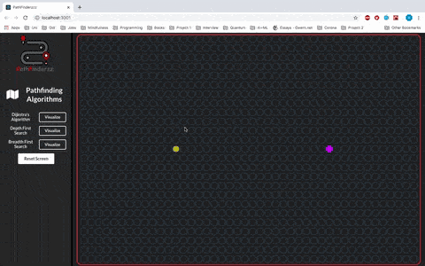

#PathFinderrz 

PathFinderzz is a single page web application. 
It was created using the React frontend framework and allows users to visualise different pathfinding algorithms.

#To Install
1. Clone Repository 
2. Npm install 
3. Npm start

#Demo

